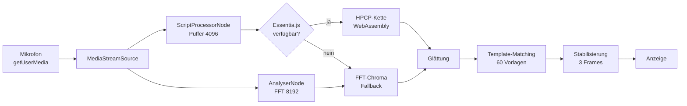

# Live-Akkorderkennung mit HPCP-Chroma

Eine Webanwendung, die das Mikrofonsignal in Echtzeit analysiert, daraus einen
Chroma-Vektor (HPCP, *Harmonic Pitch Class Profile*) berechnet und den gespielten
Akkord oder Einzelton erkennt. Die Verarbeitungskette folgt der
[Real-Time-HPCP-Chroma-Demo](https://mtg.github.io/essentia.js/examples/#/demos/hpcp-chroma-rt)
der Music Technology Group (MTG) der Universitat Pompeu Fabra, Barcelona.

Seminarprojekt im Fach **Musikinformatik**, Heinrich-Heine-Universität Düsseldorf.

**Autor:** [ Ali Kianrad , Fatemeh Naghipour ] · 

**Live-Demo:** `https://<benutzername>.github.io/<repository>/`

---

## Funktionen

- **Analyse starten:** fragt den Mikrofonzugriff an, öffnet den Audiostrom und schaltet den Knopf in den Zustand „Höre zu …“.
- **Analyse stoppen:** beendet alle Spuren des Mikrofonstroms (die Mikrofonanzeige des Betriebssystems erlischt), trennt alle Audioknoten, schließt den `AudioContext` und setzt die Oberfläche zurück.
- **Zentrale Anzeige:** der erkannte Akkord in großer Schrift, umgeben von einem Chroma-Rad mit den zwölf Tonklassen. Akkordtöne werden markiert, der Grundton farbig hervorgehoben.
- **Erkannte Akkordtypen:** Dur, Moll, vermindert, übermäßig sowie Einzeltöne, jeweils auf allen zwölf Grundtönen (60 Vorlagen).
- **Audio-Monitor:** zeigt Verfahren, Abtastrate, Puffergröße, Anzahl der Frames, Rechenzeit pro Frame, Pegel in dBFS, die drei besten Kandidaten, den HPCP-Vektor und ein Protokoll aller Ereignisse.
- **Fallback-Architektur:** Kann Essentia.js nicht geladen werden oder tritt zur Laufzeit ein Fehler auf, wechselt die Anwendung automatisch auf eine eigene FFT-Chroma-Berechnung mit dem `AnalyserNode`. Die Analyse läuft ohne Unterbrechung weiter.
- **Einstellungen:** Notenschrift international (C … B) oder deutsch (C … H), einstellbare Stille-Schwelle, Fallback manuell erzwingen (zum Vergleich beider Verfahren in der Präsentation).

## Schnellstart

Der Mikrofonzugriff (`getUserMedia`) ist nur in einem sicheren Kontext erlaubt,
also über **HTTPS** oder **localhost**. Ein Öffnen der Datei per Doppelklick
reicht deshalb nicht in jedem Browser.

### Veröffentlichung über GitHub Pages

1. Repository auf GitHub anlegen und alle Dateien hochladen:
   ```bash
   git init
   git add .
   git commit -m "Live-Akkorderkennung mit Essentia.js"
   git branch -M main
   git remote add origin https://github.com/<benutzername>/<repository>.git
   git push -u origin main
   ```
2. Im Repository unter **Settings → Pages** als Quelle *Deploy from a branch*, Branch `main`, Ordner `/ (root)` wählen.
3. Nach ein bis zwei Minuten ist die Seite unter `https://<benutzername>.github.io/<repository>/` erreichbar.

### Lokal testen

```bash
cd live-akkorderkennung
python3 -m http.server 8000
```

Anschließend `http://localhost:8000` im Browser öffnen.

## Projektstruktur

```
live-akkorderkennung/
├── index.html              Oberfläche (Kopf, Chroma-Rad, Monitor)
├── css/
│   └── style.css           dunkles Farbschema, responsives Layout
├── js/
│   ├── chords.js           Akkordvorlagen und Template-Matching
│   ├── fallback-chroma.js  FFT-Chroma ohne WebAssembly
│   └── app.js              Audio-Eingang, HPCP, Zustandsverwaltung, Darstellung
└── README.md
```

Es gibt keinen Build-Schritt und keine Abhängigkeiten außer Essentia.js,
das zur Laufzeit von jsDelivr geladen wird.

## Signalverarbeitung



### 1. Audio-Eingang

`getUserMedia` wird mit abgeschalteter Echounterdrückung, Rauschunterdrückung
und automatischer Verstärkungsregelung aufgerufen, weil diese Sprachfilter
Musiksignale verfälschen. Der `ScriptProcessorNode` liefert Blöcke von 4096
Samples, bei 44,1 kHz also etwa alle 93 ms (≈ 10,8 Frames pro Sekunde). Der
Knoten ist über einen stummgeschalteten `GainNode` mit dem Ausgang verbunden,
da Chrome den Knoten sonst nicht aufruft; eine Rückkopplung ist ausgeschlossen.

### 2. HPCP mit Essentia.js (Hauptverfahren)

Die Kette entspricht der MTG-Demo:

| Schritt | Essentia-Algorithmus | Parameter |
|---|---|---|
| Fensterung | `Windowing` | Blackman-Harris 62 dB, Größe 4096, normiert |
| Betragsspektrum | `Spectrum` | Größe 4096 |
| Spektralspitzen | `SpectralPeaks` | 60 Hz bis 4000 Hz, höchstens 100 Spitzen |
| Spektrale Weißung | `SpectralWhitening` | bis 4000 Hz |
| Pitch-Class-Profil | `HPCP` | 12 Bins, Referenz 440 Hz, Band-Split 500 Hz, nichtlinear, `unitMax` |

Essentia legt Bin 0 des HPCP auf die Referenzfrequenz, also auf **A**. Die
Anwendung rotiert den Vektor deshalb so, dass Index 0 dem Ton C entspricht.
Beim Laden läuft ein **Selbsttest**: Ein synthetischer 440-Hz-Sinus muss in der
Tonklasse A landen. Das Protokoll zeigt das Ergebnis an. Alle von Essentia
erzeugten WASM-Vektoren werden nach jedem Frame mit `delete()` freigegeben,
damit im Dauerbetrieb kein Speicher verloren geht.

### 3. FFT-Chroma (Fallback)

Der Fallback liest das Betragsspektrum des `AnalyserNode` (FFT-Größe 8192,
ohne zeitliche Glättung) und verarbeitet es wie folgt:

1. Nur lokale Maxima im Bereich 80 Hz bis 4000 Hz, die höchstens 60 dB unter der stärksten Spitze liegen.
2. Abbildung jeder Spitze auf die nächste Tonklasse: *MIDI = 69 + 12 · log₂(f / 440 Hz)*.
3. Gewichtung mit cos² der Abweichung vom Halbtonraster (entspricht der *squaredCosine*-Gewichtung von HPCP).
4. Summe der Energien je Tonklasse, Normierung auf das Maximum.

Der Fallback wird aktiviert, wenn WebAssembly fehlt, das Skript nicht geladen
werden kann, die Initialisierung länger als 15 Sekunden dauert, der Selbsttest
scheitert oder Essentia während der Analyse einen Fehler wirft.

### 4. Akkorderkennung

- **Glättung:** exponentielles gleitendes Mittel, neuer Frame mit Gewicht 0,35.
- **Stille:** Liegt der RMS-Pegel unter der Stille-Schwelle (Standard −50 dBFS), findet keine Erkennung statt.
- **Template-Matching:** Der Chroma-Vektor wird per Kosinus-Ähnlichkeit mit 60 binären Vorlagen verglichen (12 Grundtöne × Dur, Moll, vermindert, übermäßig, Einzelton).
- **Konfidenz:** Unter 60 % Ähnlichkeit zeigt die Anzeige „?“.
- **Stabilisierung:** Die Anzeige wechselt erst, wenn dasselbe Ergebnis in drei aufeinanderfolgenden Frames gewonnen hat (etwa 0,28 s). Das verhindert Flackern.

Übermäßige Dreiklänge sind symmetrisch: C+, E+ und G♯+ bestehen aus denselben
Tonklassen und lassen sich über Chroma allein nicht unterscheiden. Bei
Gleichstand entscheidet die Tonklasse mit der höchsten Energie als Grundton.

## Grenzen des Verfahrens

- Chroma-Merkmale enthalten keine Oktavinformation. Umkehrungen werden deshalb als Grundstellung erkannt (C/E erscheint als C).
- Obertöne erzeugen Energie in fremden Tonklassen, vor allem in der Quinte (3. Teilton) und der großen Terz (5. Teilton). Ein einzelner tiefer Ton kann dadurch als Dur-Akkord erkannt werden.
- Septakkorde und erweiterte Akkorde werden auf den ähnlichsten Dreiklang abgebildet.
- Die Frequenzauflösung ist bei tiefen Tönen begrenzt: Bei 4096 Samples und 44,1 kHz beträgt der Bin-Abstand etwa 10,8 Hz, der Halbtonabstand bei 65 Hz (C2) nur etwa 3,9 Hz.
- `ScriptProcessorNode` gilt als veraltet und läuft im Haupt-Thread. Er wird hier verwendet, weil die MTG-Referenz dieses Muster nutzt und alle aktuellen Browser ihn noch unterstützen. Eine Portierung auf `AudioWorklet` ist eine naheliegende Erweiterung.

## Browser-Unterstützung

Getestet werden sollte in aktuellen Versionen von Chrome, Edge, Firefox und
Safari. Voraussetzung sind Web Audio API, `getUserMedia` und für das
Hauptverfahren WebAssembly. Ohne WebAssembly läuft die Anwendung mit dem
Fallback.

## Quellen

- MTG: *Essentia.js Real-Time HPCP Chroma Demo.* https://mtg.github.io/essentia.js/examples/#/demos/hpcp-chroma-rt
- Essentia.js, Dokumentation und Quellcode: https://mtg.github.io/essentia.js/
- Correya, A. et al. (2020): *Essentia.js: A JavaScript Library for Music and Audio Analysis on the Web.* Proceedings of ISMIR 2020.
- Gómez, E. (2006): *Tonal Description of Music Audio Signals.* Dissertation, Universitat Pompeu Fabra, Barcelona.
- Fujishima, T. (1999): *Realtime Chord Recognition of Musical Sound: A System Using Common Lisp Music.* Proceedings of ICMC 1999.
- W3C: *Web Audio API.* https://www.w3.org/TR/webaudio/

## Lizenz

Essentia.js steht unter der AGPL-3.0. Wer dieses Projekt öffentlich
weitergibt, sollte die Lizenzbedingungen von Essentia.js beachten und eine
passende Lizenzdatei ergänzen.
